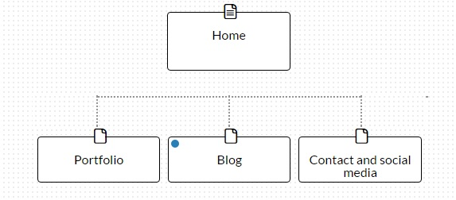

##What are the 6 Phases of Web Design?

 - Information Gathering
 - Planning
 - Design
 - Development
 - Testing and Delivering
 - Maintanence

##What is your site's primary goal or purpose? What kind of content will your site feature?

The Primary goal of the site is to entice future employers of clients. The kind of content I want to feature should highlight my expertise and prove that I am capable. I want to incorporate projects and blog posts demonstrating my abilities along with any social media I am active in.

##What is your target audience's interests and how do you see your site addressing them?
My target audience would be senior developers or hiring developers who would be interested in my ability and production potential. I would like to have my high level personal projects working appropriately and links to my github and code easily found.

##What is the primary "action" the user should take when coming to your site? Do you want them to search for information, contact you, or see your portfolio? It's ok to have several actions at once, or different actions for different kinds of visitors.

At this point I think the primary actions will be to see my portfolio and have a call to action to contact me if they are interested.

##What are the main things someone should know about design and user experience?

Design is a lot about how the site looks, the colors chosen and the fonts selected and so on. But beyond that it encapsulates a lot of the planning and information gathering steps in creating as well. User experience is how someone feels when interacting with your product. It is a strong motivator to whether or not someone will find your website or application useful and meaningful to them. A strong user experience should be implemented not only to the main system but also to subsystems (checkouts for purchases, filling out forms for surveys).

##What is user experience design and why is it valuable?

User experience is how a person feels when interacting with a system. In our case that means web applications/ websites. UX is valuable because ultimately we want many users to want to use our website. In most cases we are building web applications to be used by other people then us. What we find cool and useful may not be what our potential users would find useful. Most websites or web applications succeed or fail based on the ability to attract and retain lots and lots of users, so obviously we want to appeal to those users.

##Which parts of the challenge did you find tedious?

This is not something I found tedious but more a little confusing or maybe premature. Based on what I view my site will look like I am afraid my site map is a little insufficient. I feel like my personal site would be better as a one page site as there will not be too much info that doesn't need to be redirected somewhere else (blog, linkedin and so on.)

