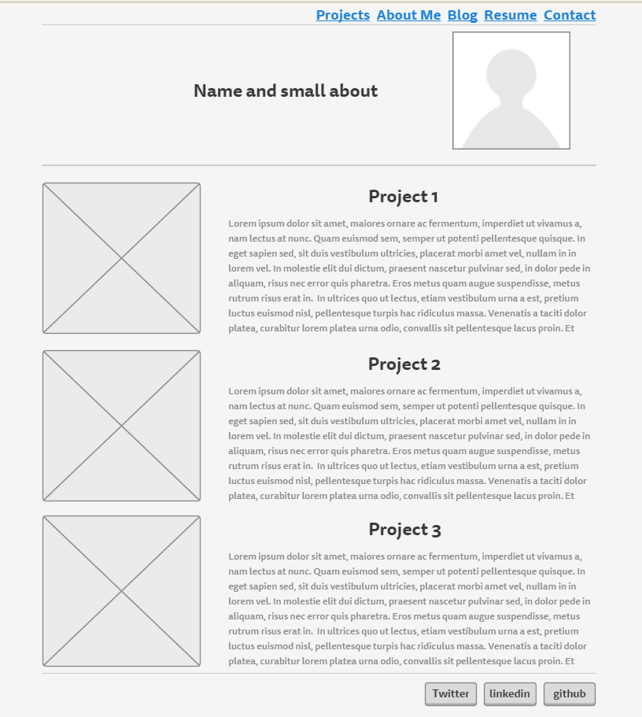
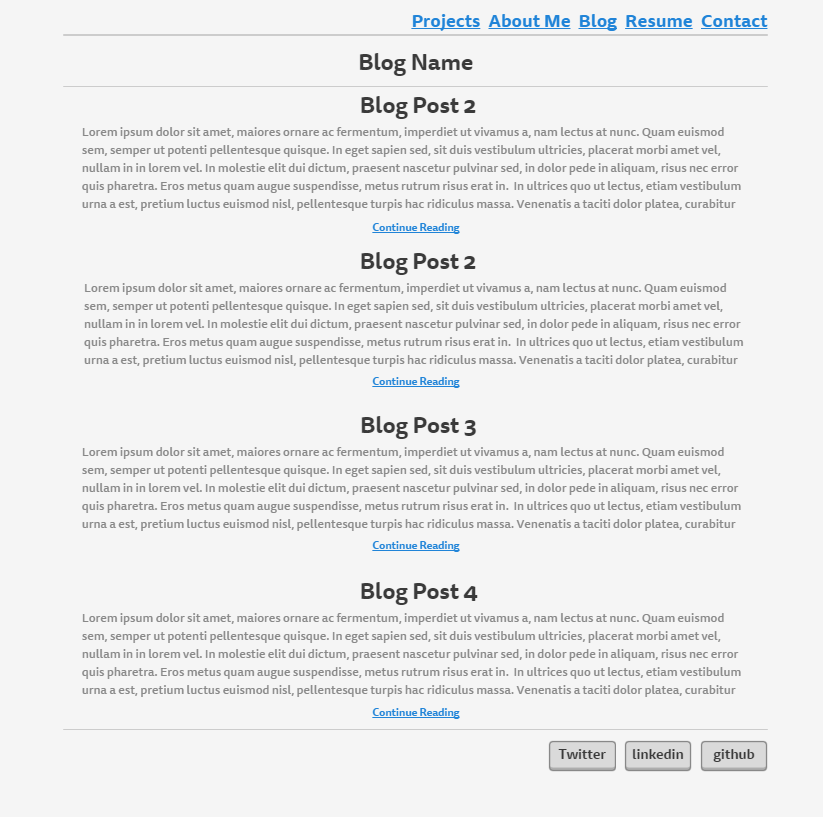

##Index Wireframe

##Blog Index Wireframe

##What is a wireframe?
A wireframe is a visual representation of what your webpage(s) is going to look like. It is a tool used to help you define the importance of your information, and allows you to visually represent your idea without to much effort.
##What are the benefits of wireframing?
Wireframing allows you to actually see a rough layout of what your site will eventually look like. Too often people just start coding away on a site with just an idea in their head without ever actually taking a look at it. If you jot it down to paper or using an online tool first you can check to see whether it is feasible, whether it will work with your content and have a strong reference for what you are trying to build.

##Did you enjoy wireframing your site?
Often you can just start typing away on a site and then realize it may not work or look as pleasing as you originally thought. It's best to give yourself a rough graphical representation of what you are envisioning in your head prior to coding just to make sure it will turn out how you want it. You can also quickly draw out two alternatives and have a stronger basis of comparison. If you have a rough sketch you can reference it to not veer to far from the original design idea as well.

##Did you revise your wireframe or stick with your first idea?
I mostly stuck with my main idea, I moved some of headings to the far right rather than in the middle as I had originally envisioned. I could see that changing possibly as the elements of the site become more real to me potentially.

##What questions did you ask during this challenge? What resources did you find to help you answer them?
What is a good design for a personal portfolio page? what do I want to pop out first to any visitors? I got most of my idea by looking at example links given throughout the Beginners Guide to Wireframing reading.

##Which parts of the challenge did you enjoy and which parts did you find tedious?
I enjoyed this challenge quite a bit. It brought more relevance to the UI 2.3 UI assignment and I enjoyed putting together a layout of what I hope my site will look like. The part I found tedious was trying to line everything up perfectly in the wireframing tool that I was using. I found myself spending probably too much time trying to make it look just right which is my own fault, but I found it hard not to do.

