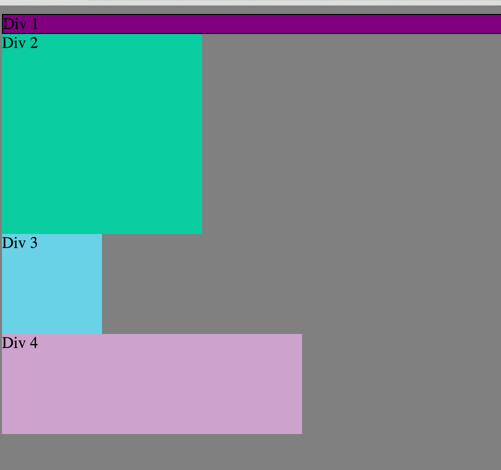
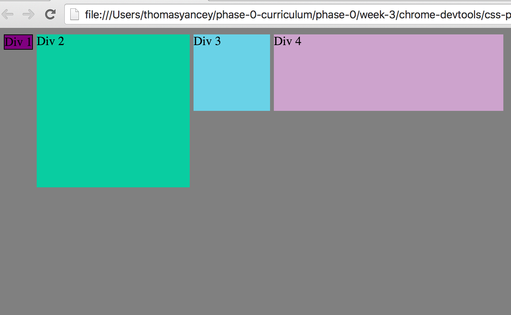
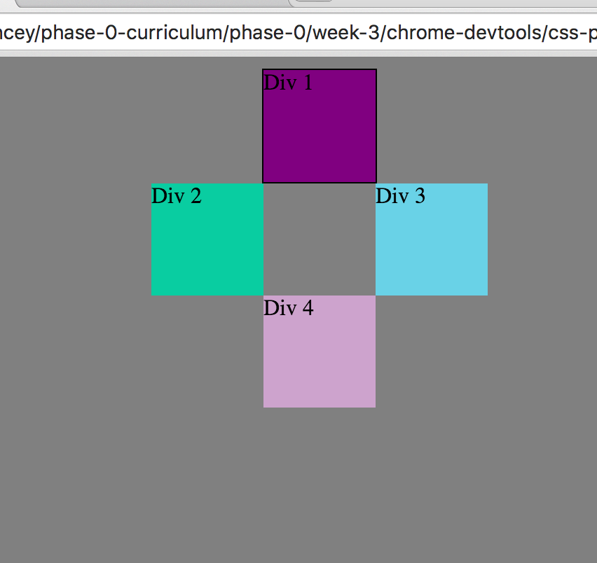

####Change the Colors
  
####Column
  
####Row
  
####Make Equidistant
  
####Squares
  
####Footer
  
####Header
  
####Sidebar
  
####Get Creative
  

##How can you use Chrome's DevTools inspector to help you format or position elements?
  using the style.element when you select an element you want to change. This way you can test changes prior to changing the actual CSS file and see realtime updates.

##How can you resize elements on the DOM using CSS?
  Using height and width attributes and giving them different kinds of values (%, em, px, vh)

##What are the differences between absolute, fixed, static, and relative positioning? Which did you find easiest to use? Which was most difficult?
  relative position - you position it relative to where it would otherwise be on the page
  absoulute position - An element where you place it exactly in it's place and it will not move
  static position - The element uses the normal behavior and is in it's current position of the flow. left, right, top and bottom do not apply.
  fixed - is an an absolute position and does not move when the screen is scrolled.

  We used relative to complete the final challenge and once I understood it I found it to be not too difficult and very useful.

##What are the differences between margin, border, and padding?
  -margin is the outer layer representing a distance between the element and the next element near it
  -Border is the last visible portion of an element that you can attach to it
  -Padding is the space between the border and content

##What was your impression of this challenge overall? (love, hate, and why?)
  I really enjoyed this challenge, it started out easy and then got significantly harder. It pointed out my weaknesses in CSS and also taught me somethings I was confused about such as fixing a navbar to the top.
