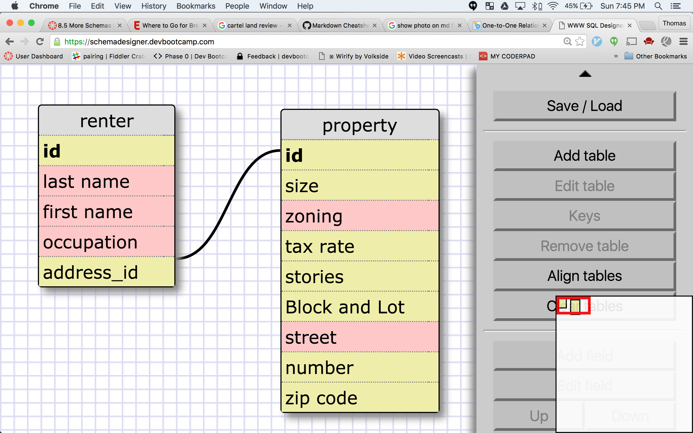
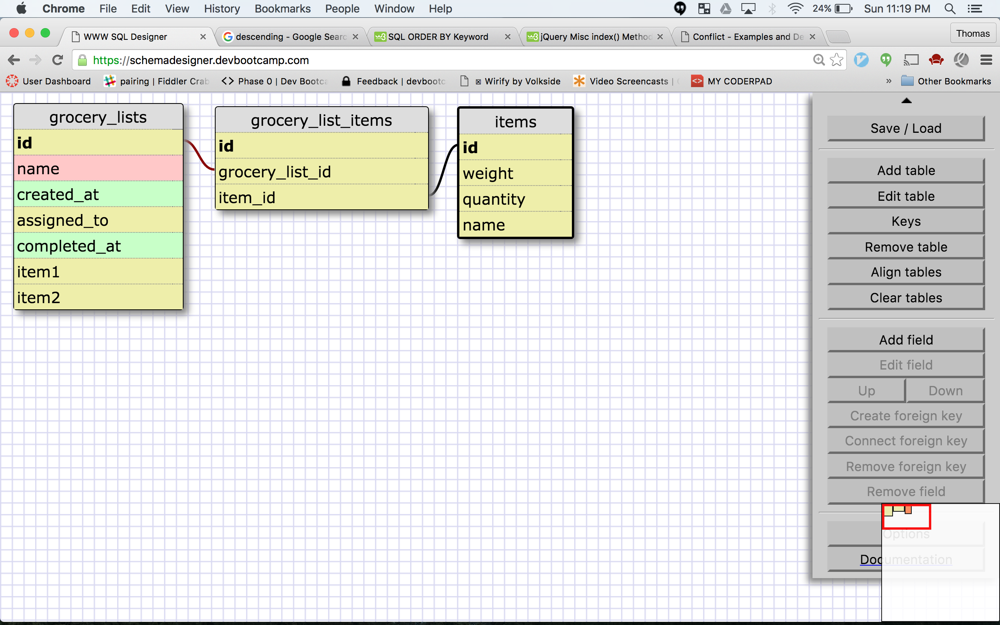

###What is a one-to-one database?
A one-to-one database is one in which one field belongs to one other field or property. for example each state only has one capital and each capital only has one state. Another example would be a family has a dog, each dog has only one family and each family has only one dog.
###When would you use a one-to-one database? (Think generally, not in terms of the example you created).
When something belongs to only one thing and that thing belongs only to that something.
###What is a many-to-many database?
A many to many database is one in which one item belongs to many things and many things belong to that item. The example in the excercise was grocery items belong to many grocery lists and vice versa. Another example would be tests belong to many students and many students take those tests.
###When would you use a many-to-many database? (Think generally, not in terms of the example you created).
When one thing relates to many things. many people fill out forms and many forms are filled out by people for example.
###What is confusing about database schemas? What makes sense?
Conceptually I feel like I can understand it but when it comes to actually applying it to real life objects I think I need more practice.
