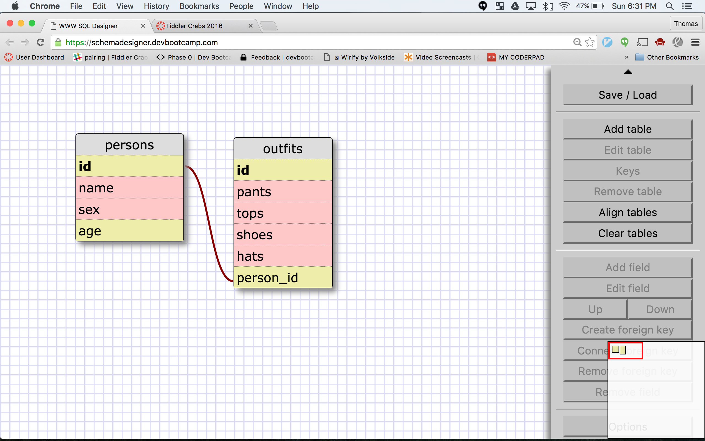

### 1.
SELECT * FROM states;
### 2.
SELECT * FROM regions;
### 3.
SELECT state_name,populations FROM states;
### 4.
SELECT state_name,population FROM states..
ORDER BY population DESC;
### 5.SELECT state_name FROM states
###   WHERE region_id=7;
### 6.SELECT state_name,population_density FROM states
###   WHERE population_density>=50
###   ORDER BY population_density ASC;
### 7.SELECT state_name FROM states
###   WHERE population BETWEEN 1000000 AND 1500000;
### 8.SELECT state_name,region_id FROM states
###   ORDER BY region_id ASC;
### 9.SELECT region_name FROM regions
###   WHERE region_name LIKE '%Central';
### 10. SELECT regions.region_name,states.state_name
###     FROM states
###     INNER JOIN regions
###     ON states.region_id=regions.id
###     ORDER BY regions.id;

